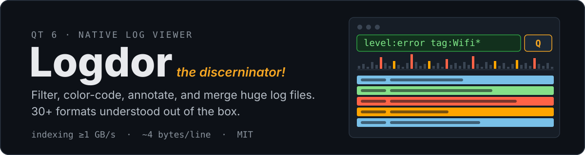
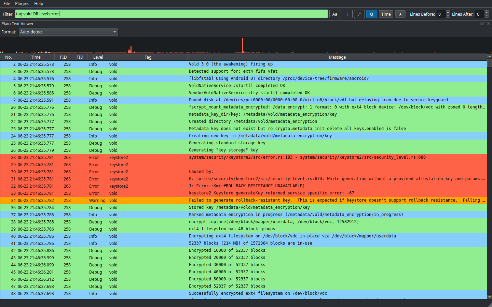

<p align="center">
  
</p>

<p align="center">
  
</p>
<p align="center"><sub>A real 9.8M-line logcat, indexed in ~2 s: field query <code>tag:vold OR level:error</code>, severity colors, timeline histogram.</sub></p>

Logdor is a native Qt log viewer for files too big for a text editor. It
memory-maps the file and indexes it quickly, auto-detects the format, 
and parses only the rows on screen. So a
1 GB log opens in about two seconds and filters without lag.

## Highlights

- **30+ formats built in** logcat, syslog, Apache/nginx, JSON Lines,
  journalctl, Docker, Kubernetes CRI/klog, dmesg, auditd, CEF/LEEF, Snort,
  W3C/IIS, and more. Add your own by dropping a [declarative JSON
  spec](core/formats/) into `~/.local/share/logdor/formats` no compiling,
  or author one interactively with the live-regex Custom Format Viewer.
- **Field query language** `level:error tag:Wifi* pid>=100 "free text"`
  with AND/OR/NOT (toggle the `Q` button), plus plain-text, regex, and
  time-range filtering with saved presets.
- **Timeline** a severity-colored histogram of the visible rows over time;
  click to jump, drag to restrict the filter to a time range.
- **Annotations** right-click a line to attach a note; notes live in a
  sidecar file (`<log>.logdor.json`) keyed by content, so they survive
  restarts, renames, and rotation and you can share the sidecar with a
  colleague or export an HTML/CSV report.
- **Merged timeline** interleave events from multiple files (even in
  different formats) into one time-sorted view.
- **Live tail** follow a growing file (F8); filters keep applying, and
  rotated or truncated files reload automatically.
- **Folder workflows** open a directory tree and hop between files with
  their view state intact, or grep the whole tree (gzipped logs included)
  and jump to any match. `*.gz` files open directly.
- **Highlight rules** color lines matching your patterns in every viewer.

The main viewer renders every format - built-in, user-defined, and
file-derived ones like CSV tables, W3C/IIS logs, and Chrome NetLog
captures - while specialized viewer plugins add distinct views: hex
dumps, Android logcat filtering, merged timelines, and even plotting
coordinates found in log lines on a map. See
[docs/ARCHITECTURE.md](docs/ARCHITECTURE.md) for the full list and how to
write your own.

## Architecture

Two layers, kept strictly apart:

- **`core/`** a GUI-free functional core (QtCore only, enforced at build
  time): mmap file access, line indexing, format parsers and auto-detection,
  the query engine, and off-thread filtering/sorting.
- **`app/` + `plugins/`** the Qt Widgets shell and viewer plugins, thin
  wrappers over one shared lazy table view that parses only visible rows.

## Building

Requires CMake >= 3.22, Qt >= 6.8, and a C++20 compiler.

```bash
cmake -B build        # or /path/to/Qt/6.x/gcc_64/bin/qt-cmake -B build
cmake --build build
build/app/logdor /path/to/file.log
```

Unit tests run with `ctest --test-dir build -L unit --output-on-failure`.
Performance benchmarks are opt-in: configure with `-DLOGDOR_ENABLE_BENCH=ON`
and run the `bench` label (gates: >1000 MB/s indexing, <4.5 bytes/line,
<100 ms cancellation).

<details>
<summary><b>Keyboard shortcuts</b></summary>

| Shortcut | Action |
|---|---|
| Ctrl+O / Ctrl+Shift+O | Open file / folder |
| Ctrl+1 ... Ctrl+9 | Open a recent file or folder |
| Ctrl+PgDn / Ctrl+PgUp | Next / previous file in the open folder |
| Ctrl+L | Focus the filter input |
| Ctrl+Shift+F | Search in folder |
| F8 | Follow the current file (live tail) |
| Ctrl+S / Ctrl+Shift+S | Save annotations / save a copy elsewhere |

</details>

---

<p align="center">
  
</p>
<p align="center"><sub>Logdor was a man! No... he was a logging man! Or... maybe he was just a log viewer. <a href="LICENSE">MIT</a>.</sub></p>
